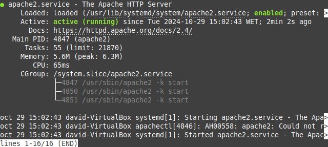
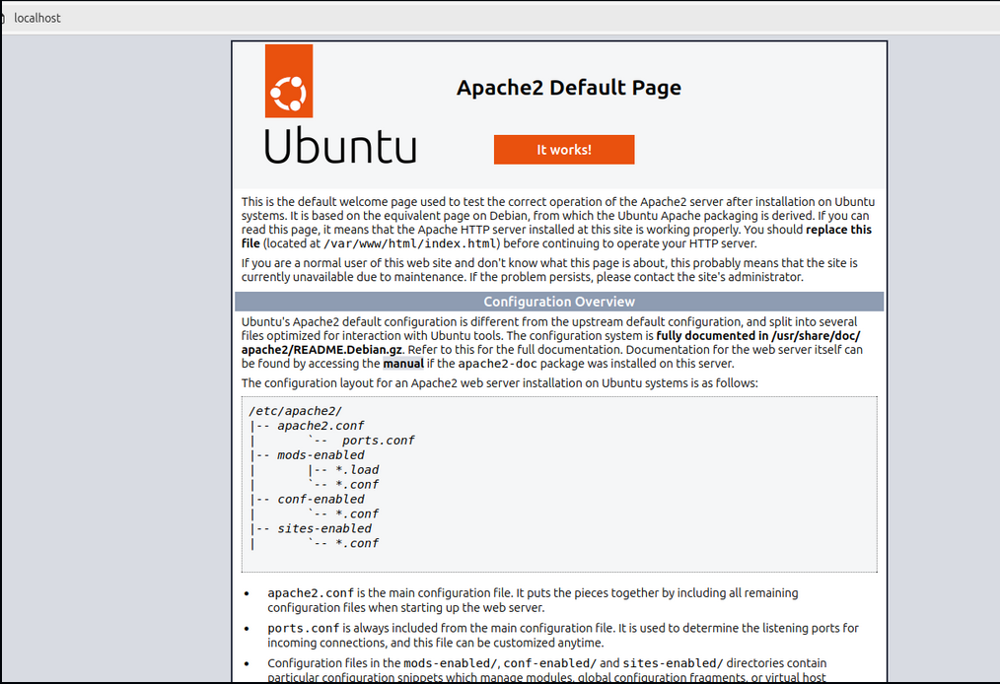
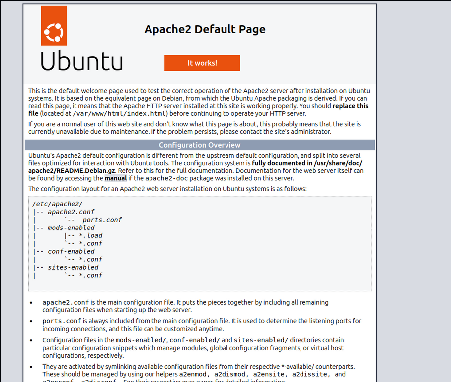

# Instalar Apache

Para instalar apache en nuestro sistema deberemos seguir los siguientes comandos en nuestros equipos.

## Primero

Instalamos el servidor de Apache:

```bash

sudo apt install apache2

```
Te saldrá un mensaje de confirmación. Para ver que todo está correcto, introduciremos el siguiente comando:

```bash

sudo systemctl status apache2

```

Te tendría que salir un mensaje como este:



## Segundo

En el navegador deberemos ir al localhost, donde nos tendría que salir algo así:



## Tercero

Hay que cambiar los permisos de las carpetas mediante el siguiente comando:

```bash

sudo chmod 755 /var/www/html

sudo chmod 644 /var/www/html/index.html

```

Volvemos al local host y te tendría que salir la siguiente imagen




# Instalar Tomcat

## Primero descargamos java

```bash

sudo apt install default–jdk

```
## Segundo, creamos un usuario para el tomcat

```bash

sudo groupadd tomcat

sudo useradd -s /bin/false -g tomcat -d /opt/tomcat tomcat
```

## Tercero, instalamos tomcat

```bash

cd /tmp

curl -O https://www-us.apache.org/dist/tomcat/tomcat-9/v9.0.17/bin/apache-tomcat-9.0.17.tar.gz

```

## Cuarto, le damos permisos de actualización

```bash
sudo mkdir /opt/tomcat

cd /opt/tomcat

sudo tar xzvf /tmp/apache-tomcat-9.0.*tar.gz -C /opt/tomcat --strip-components=1

```

## Quinto, le damos permisos de ejecución


```bash

sudo chgrp -R tomcat /opt/tomcat
sudo chmod -R g+r conf
sudo chmod g+x conf
sudo chown -R tomcat webapps/work/temp/logs/
```

## Sexto, creamos un archivo de seguridad

```bash

sudo nano /etc/systemd/system/tomcat.service

[Unit]
Description=Apache Tomcat Web Application Container
After=network.target

[Service]
Type=forking

Environment=JAVA_HOME=/usr/lib/jvm/java-1.8.0-openjdk-amd64/jre
Environment=CATALINA_PID=/opt/tomcat/temp/tomcat.pid
Environment=CATALINA_Home=/opt/tomcat
Environment=CATALINA_BASE=/opt/tomcat
Environment=’CATALINA_OPTS=-Xms512M -Xmx1024M -server -XX:+UseParallelGC’
Environment=’JAVA_OPTS.awt.headless=true -Djava.security.egd=file:/dev/v/urandom’

ExecStart=/opt/tomcat/bin/startup.sh
ExecStop=/opt/tomcat/bin/shutdown.sh

User=tomcat
Group=tomcat
UMask=0007
RestartSec=10
Restart=always

[Install]

WantedBy=multi-user.target


sudo systemctl daemon-reload

cd /opt/tomcat/bin

sudo ./startup.sh run

```

