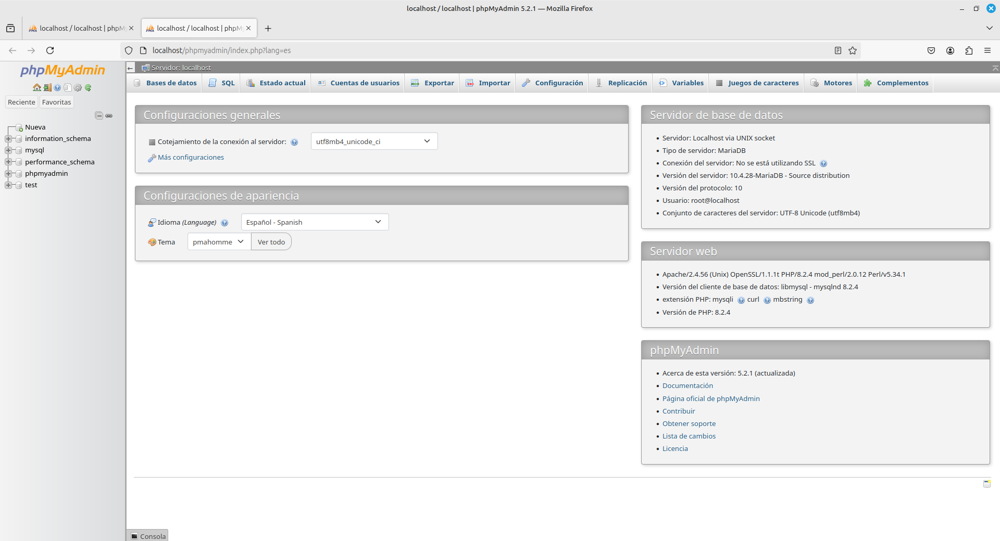
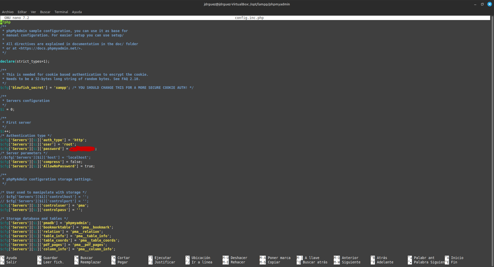
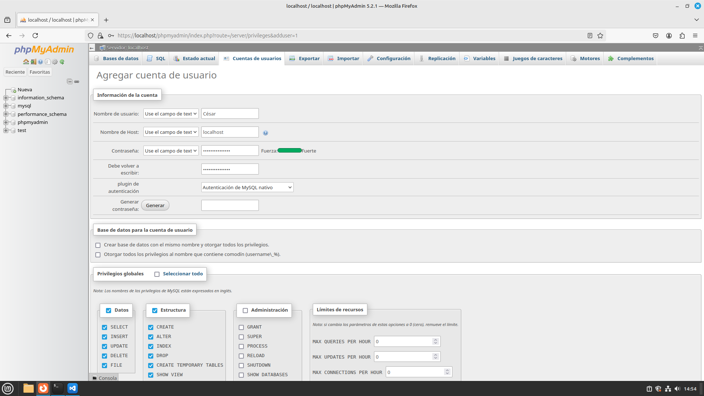

## 1. Se procede a ejecutarlo. Debemos esperar que termine de ejecutarse.

``` bash
sudo opt/lampp/xampp start
```
#### Mediante este comando se ejecutan los servicios de xampp, apache y php.

#### Después del paso anterior, pondremos en el navegador localhost/phpmyadmin y nos saldrá lo siguiente:


#### Hay que cambiar la contraseña al root para segurizar el servidor. Se cambiaría desde el propio panel del phpmyadmin. Después de cambiarlo dejará de funcionar.
#### Mediante el siguiente comando se pararán los servicios y se ingresará el documento a cambiar:
```bash
sudo opt/lampp/xampp stop
cd opt/lampp/phpmyadmin
sudo nano config.inic.php
```
- Cambiamos la contraseña a la que sea necesario.


#### Crearemos un usuario y le pondremos contraseña y permisos.



#### Cambiaremos el fichero config otra vez para poder darle al panel de php que pregunte antes de entrar que usuario usar.
```bash
cd opt/lampp/phpmyadmin
sudo nano config.inic.php
```
- Modificaremos el apartado de $Cfg['Server']['Aut_type']='http'

