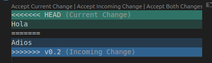
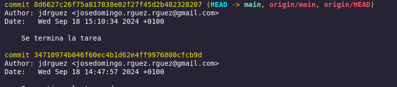
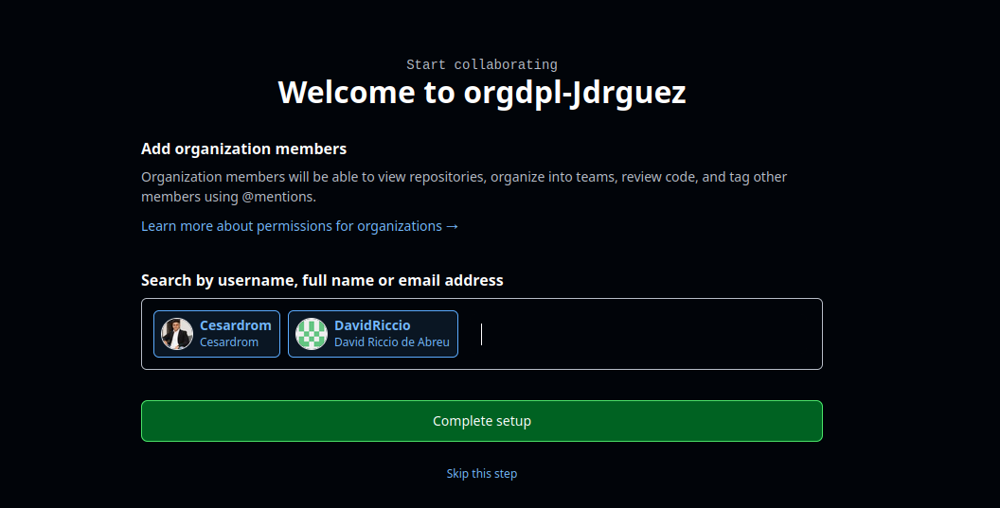
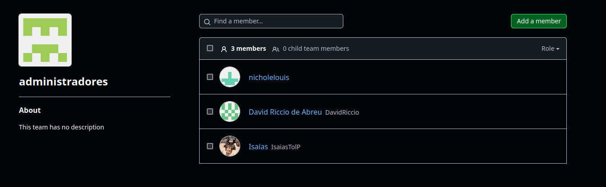
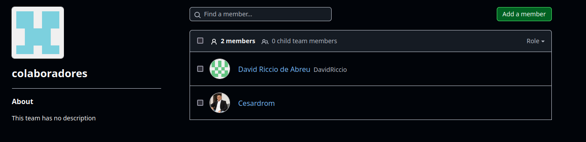
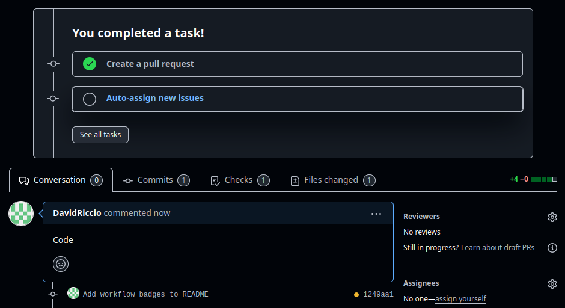
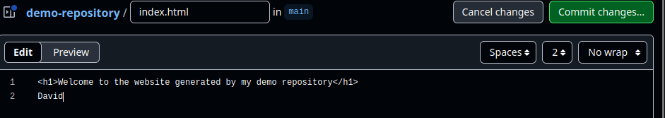

# Tarea 1_2 de Git. Usando las ramas. 


## RAMAS

Para crear una rama se utilizan los siguientes comandos
```
git branch v0.2 
git checkout v0.2
```

Despues utilizamos el comando Git merge v0.2 para fusionar las ramas 



Despues desde cada una de las ramas modificamos un archivo y hacemos commit creando un conflicto el cual se resuelve haciendo un merge de las ramas.

Listamos las ramas con merge


Creamos el tag con git tag -a -m y borramos la rama con git branch -d


hacemos un git log para ver los cambios y sus tags 


## ORGANIZACIONES 

Creamos organizaciones



Creamos los equipos





