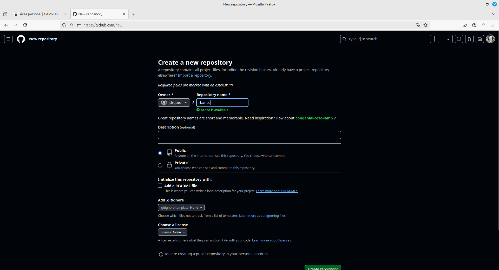
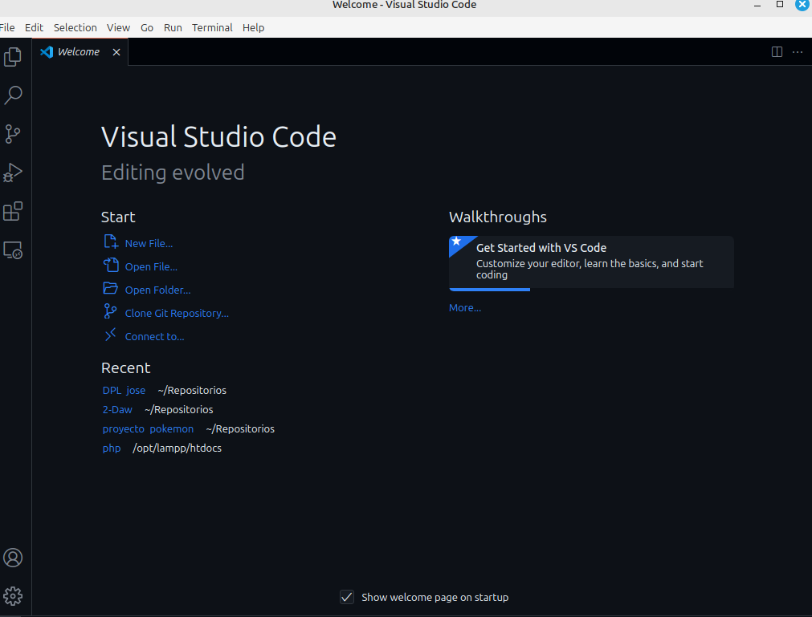
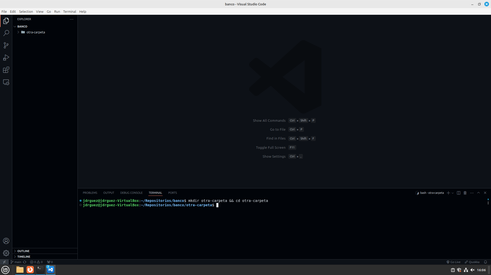
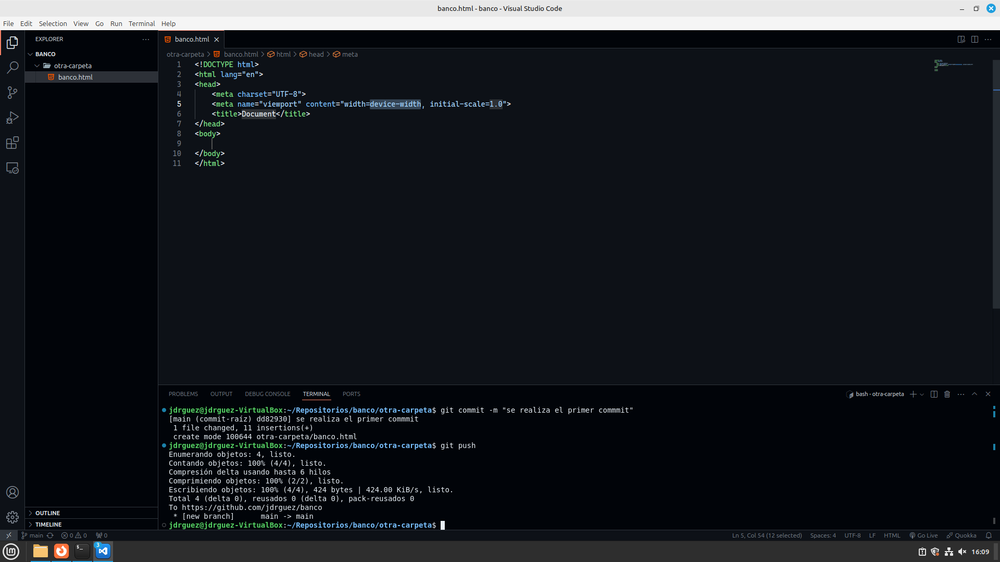
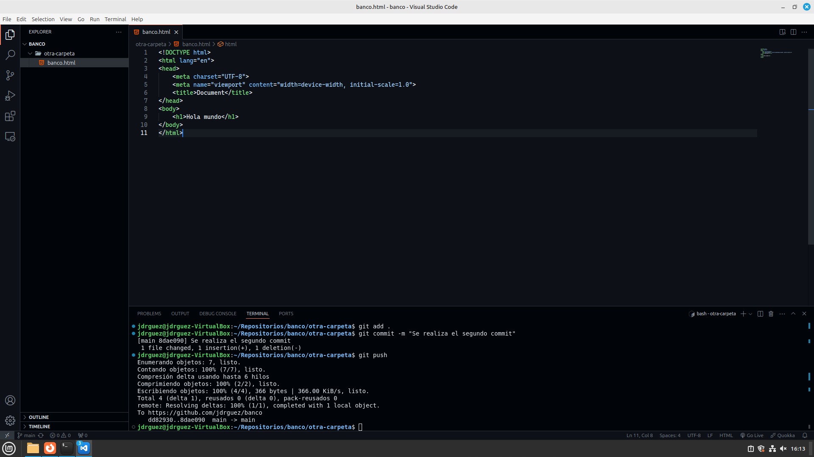

# Visual studio code y sus ventajas.

## Como crear la cuenta:
Para realizar este paso tiene que entrar en el siguiente enlace:
https://github.com/.

Una vez dentro, te saldrá en el medio de la pantalla que te registre y te logues.

* En mi caso no lo realizaré porque ya tengo cuenta con github.

## Crea el repositorio banco

Una vez creada la cuenta, deberemos de ir a repositorios y al lado de este, en verde, pondrá new. Le daremos click y saldrá la siguiente información:



Rellenados los datos, le damos a crear. Copiamos el enlace del mismo. En mi caso es el siguiente: 
https://github.com/jdrguez/banco


## Clonamos el repositorio en VScode.

Abrimos VScode. Nos saldrá lo siguiente:



Le daremos a la opción clone git repository y pegamos nuestro enlace.


## Crea una carpeta dentro del repositorio

Mediante el siguiente comando:

``` bash
mkdir otra-caperta && cd otra-carpeta
```

Se realizará lo siguiente:




## Haz commit y push

Para que git interprete que algo tiene que poner en su commit, crea un html dentro de la carpeta con el nombre de banco.html y escribe ! y le das a tab.

En el terminal utilizaremos los siguientes comandos:

```bash
git add .
git commit -m "Se realiza el primer commit"
git push
```

Saldrá lo siguiente:



## Borrar del disco

Eliminas todos los archivos del sistema. Después tendrías que realizar los primeros pasos para que vuelva el repositorio a tu equipo, para que lo puedas reclonar. Esto nos ayudará a la ejecución del siguiente comando.

Utilizas en la terminal lo siguientes comandos:

```bash
git pull

```

## Modificar archivo

Modificas cualquier archivo y ejecutas el commit como se hizo anteriormente.

```bash
git add .
git commit -m "Se realiza el segundo commit"
git push
```

