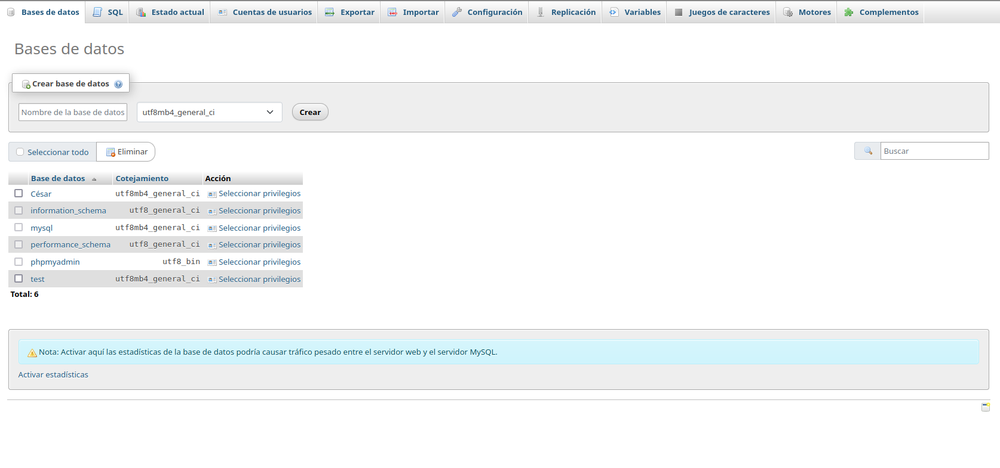
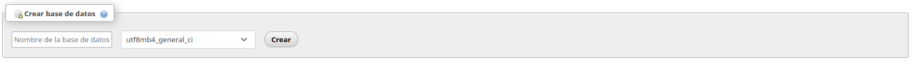
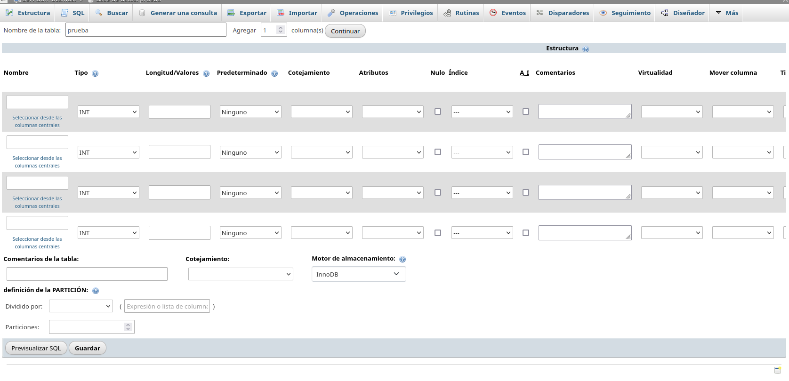
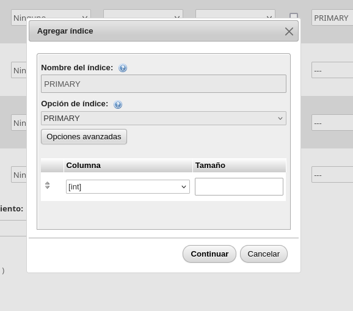
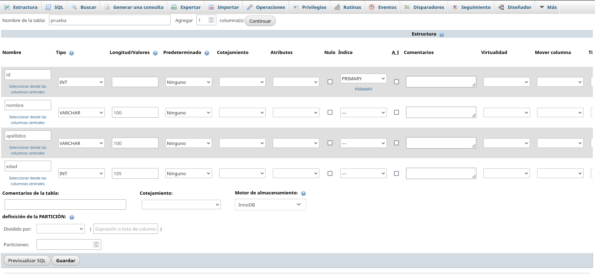
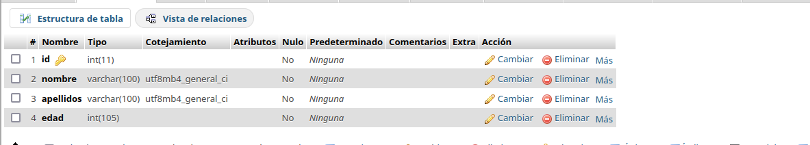

# Creación de base de datos

## Desde PHPMYAdmin, ejecutamos los siguientes pasos



### Esta imagen es lo que representa la página principal del phpmyadmin. Le daremos a base de datos. Y nos representa lo anterior.

### Ahora le daremos a crear. Le ponemos nombre.



### Nos saldrá está vista que nos permitirá disponer los campos de las tablas con sus características.

### Para agregarle una id con primary key tenemos que utilizar la pestaña de índice e indicar los valores.


### Rellenamos las tablas con sus datos principales.


### Por último, le damos a guardar y previsulizamos la tabla ya creada.



# Conectar la base de datos

En primer lugar crearemos los ficheros de index.php y insertar.php, el contenido del index es el siguiente

```php
    <?php
   $conn=  mysqli_connect('localhost','Jose','1234','prueba');
    print_r($conn);
    echo(<pre>);
```
los parametros que le pasamos son ip, nombre, contraseña y la tabla.

El contenido de insertar.php es el siguiente
```php
<?php
   $conn=  mysqli_connect('localhost','Jose','1234','prueba');
    print_r($conn);
    echo"<pre>";

    $insert =   "INSERT into prueba(name,edad)
    values('square', 15)";

   $return = mysqli_query ($conn,$insert);
   mysqli_close($conn)
``` 
Donde se inserta esta informacion en la base de datos como podemos ver en esta imagen.

