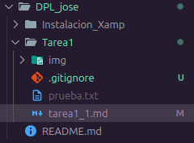
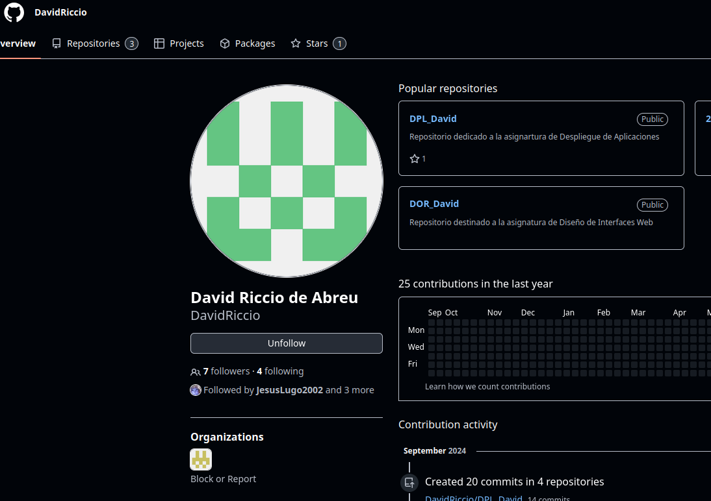

# Tarea 1 de Git 


## COMANDOS UTILIZADOS 

```Git 

- Git add .
- Git commit -m "commit inicial"
-Git push 
```

## IGNORAR ARCHIVOS


Se crea un archivo .gitignore donde se añaden los archivos a ignorar (poniendo esta regexp "**/privad[ao]*" se omiten ambas), por lo cual cuando haces el commit este archivo no se sube. Los archivos en gris son los ignorados.

Para crear el archivo .gitignore se debe usar : 
```bash 
touch .gitignore
```



## AÑADIR FICHERO Y TAGS

Los comandos utilizados son 
```
 git tag -a v0.1 -m 'Version 0.1'
 git tag
 ```


## USO SOCIAL Y TABLA



| Alumno | Github |
|----------|----------|
| Nichole   |  [David](https://github.com/)  |
| Cesar | [Cesar](https://github.com/Cesardrom)  |
| Isaias   | [Nichole](https://github.com/nicholelouis) |